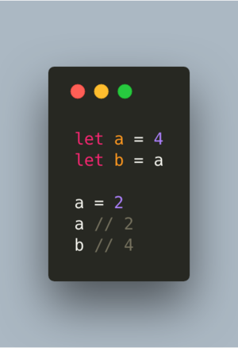
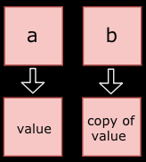
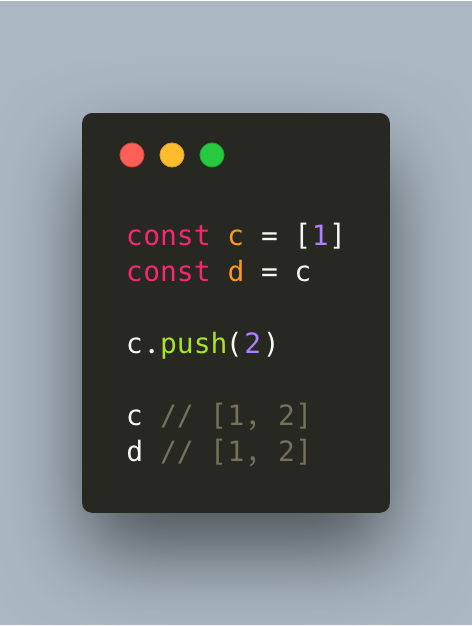
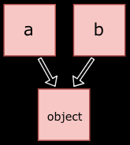
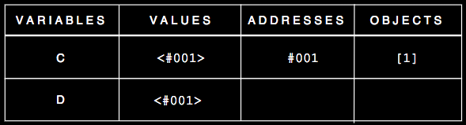

# 按值传递 VS 引用传递

几乎所有东西在JacaScript中都是对象，像数组和函数。对象是键/值对的集合，值可以是任何，这意味着它可以是主要类型或其他对象。对象有属性和方法（函数在对象之上并且这些属性和方法根据引用存活在内存中。你可以访问这些内存中的属性和方法。

所有主要类型的变量都按值互动 

  

首先，我们声明了2个变量a和b。然后，我们设置b等于a，相当于等于4。随后，我们设置a等于2。此时，b还是等于4！发生这样的事是因为b在内存中有他自己的空间！
***
当设置它们相等或将他们传入一个方法，所有非主要类型值都通过引用互动。

  

在内存中他们看起来像是：

 

变量c和d有相同的值，并且指向相同的内存地址。

变量c保持了一个对数组（对象）的引用。然后，我们赋予d与c相同的引用。如果你随后通过将一个元素推入数组来改变d的值，则其它所有变量的属性都会被改变。它们指向相同的引用，而不是拷贝。

